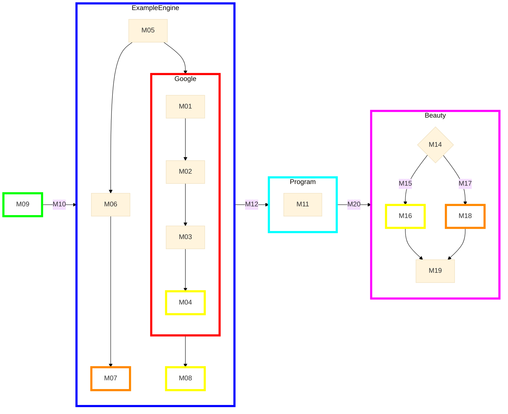

```mermaid
%%{
  init: {
    'theme': 'base'
  }
}%%

flowchart LR

  ExampleEngine:::blue
  subgraph ExampleEngine
    direction TB

    Google:::red
    subgraph Google
      direction TB

      CD:::yellow

      CA["M01"]
      CA --> CB["M02"]
      CB --> CC["M03"]
      CC --> CD["M04"]
    end

    %% Logic Flow
    WA["M05"]
    WA --> WB["M06"]
    WC:::orange
    WB --> WC["M07"]
    WA --> Google
    WD:::yellow
    Google --> WD["M08"]
  end

  Utility:::green
  Utility["M09"]
  Utility -- "M10" --> ExampleEngine

  Program:::cyan
  subgraph Program[Program]
    direction TB

    TA["M11"]
  end

  ExampleEngine -- "M12" --> Program["M13"]

  Beauty:::magenta
  subgraph Beauty
    direction TB

    GA{"M14"}
    GB:::yellow
    GA -- "M15" --> GB["M16"]
    GC:::orange
    GA -- "M17" --> GC["M18"]
    GB & GC --> GD["M19"]

  end

  Program -- "M20" --> Beauty

  classDef red fill:#FFF,stroke:#F00,stroke-width:5px;
  classDef blue fill:#FFF,stroke:#00F,stroke-width:5px;
  classDef green fill:#FFF,stroke:#0F0,stroke-width:5px;
  classDef cyan fill:#FFF,stroke:#0FF,stroke-width:5px;
  classDef yellow fill:#FFF,stroke:#FF0,stroke-width:5px;
  classDef magenta fill:#FFF,stroke:#F0F,stroke-width:5px;
  classDef orange fill:#FFF,stroke:#F80,stroke-width:5px;
```
